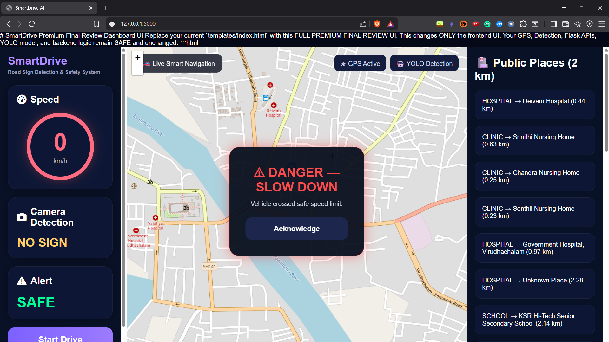

<h1 align="center">🚦 Real-Time Vision-Based Road Sign Detection and GPS-Enabled Safety Alert System using YOLO</h1>

<!-- <p align="center">
  
</p> -->

<p align="center">
  
  
  
  
  
</p>

---

# 📌 Project Description

An advanced AI-powered intelligent transportation safety system that performs:

✅ Real-time traffic sign detection  
✅ GPS-based live vehicle tracking  
✅ Zone-based safety alerts  
✅ Interactive web dashboard  
✅ Real-time route monitoring  

using **YOLO**, **OpenCV**, **Flask**, and **GPS integration**.

---

# 🎯 Objectives

- Improve road safety using AI
- Detect traffic signs instantly
- Monitor vehicle movement using GPS
- Generate real-time safety alerts
- Provide live dashboard visualization

---

# 🧠 AI Model Used

| Model | Purpose |
|------|------|
| YOLO | Traffic Sign Detection |
| OpenCV | Video Frame Processing |
| Flask | Web Server |
| GPS Module | Location Tracking |

---

# 🛠️ Tech Stack

<div align="center">

| Technology | Usage |
|------------|-------|
| Python | Backend |
| Flask | Web Framework |
| YOLO | Object Detection |
| OpenCV | Computer Vision |
| HTML/CSS/JS | Frontend |
| JSON | Route Storage |
| Ngrok | Public Hosting |

</div>

---

# 🖥️ System Architecture

```text
Camera Input
      ↓
YOLO Detection Model
      ↓
Traffic Sign Detection
      ↓
GPS Coordinate Processing
      ↓
Flask Server
      ↓
Web Dashboard + Alerts
```

---

# 🚀 Key Features

✨ Real-time object detection  
✨ GPS-enabled tracking  
✨ Route history visualization  
✨ Safety zone monitoring  
✨ Speed monitoring system  
✨ Flask-based dashboard  
✨ Interactive map support  
✨ AI-powered transportation system  

---

# 📂 Folder Structure

```bash
gps_project/
sign_Board/
static/
templates/
detect_web.py
gps_server.py
zone_alert.py
route.json
README.md
```

---

# ⚙️ Installation

## 1️⃣ Clone Repository

```bash
git clone https://github.com/andrewakash/Real-Time-Vision-Based-Road-Sign-Detection-and-GPS-Enabled-Safety-Alert-System-Using-YOLO.git
```

---

## 2️⃣ Navigate to Project Folder

```bash
cd Real-Time-Vision-Based-Road-Sign-Detection-and-GPS-Enabled-Safety-Alert-System-Using-YOLO
```

---

## 3️⃣ Create Virtual Environment

```bash
python -m venv .venv
```

---

## 4️⃣ Activate Environment

### Windows

```bash
.venv\Scripts\activate
```

### Linux / Mac

```bash
source .venv/bin/activate
```

---

## 5️⃣ Install Requirements

```bash
pip install -r requirements.txt
```

---

# ▶️ Run the Project

## Start Flask Server

```bash
python gps_server.py
```

---

## Start YOLO Detection

```bash
python detect_web.py
```

---

## Start Ngrok (Optional)

```bash
python start_ngrok.py
```

---

# 🌐 Web Interface

```bash
http://127.0.0.1:5000
```

---

# 📸 Output Screenshots

## 🚦 Traffic Sign Detection

<p align="center">
  
</p>

---

## 🛰️ Web Dashboard

<p align="center">
  
</p>

---

# 🔮 Future Enhancements

- Android mobile integration
- Voice alert assistant
- Cloud database support
- Emergency SOS system
- AI accident prediction
- Real-time analytics dashboard
- Smart city traffic integration

---

# 👨‍💻 Developer

## Akash S

🎓 Computer Science and Engineering  
🏫 SRM TRP Engineering College  

---

# 📊 GitHub Stats

<p align="center">
  
  
  
</p>

---

# ⭐ Support

If you like this project:

🌟 Star the repository  
🍴 Fork the project  
📢 Share with others  

---

# 📜 License

This project is developed for academic and educational purposes.
